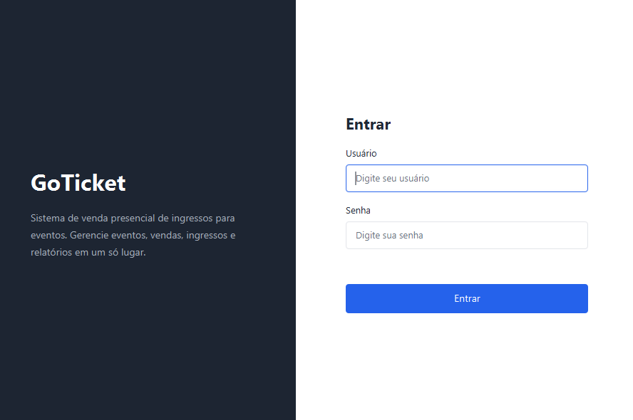
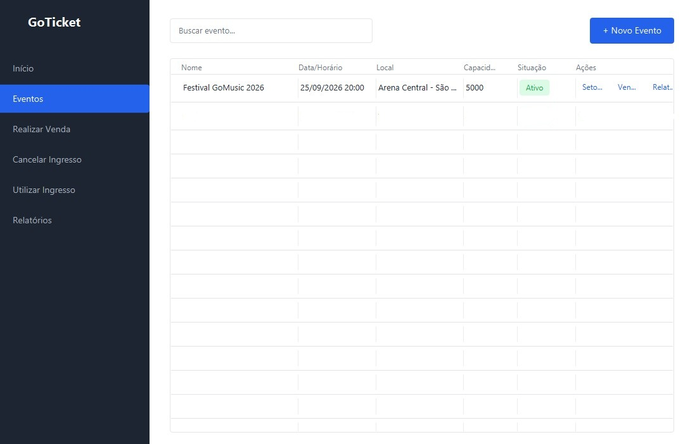
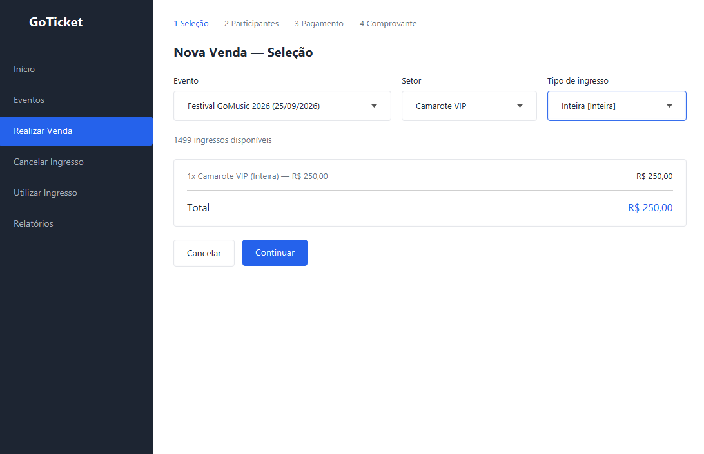
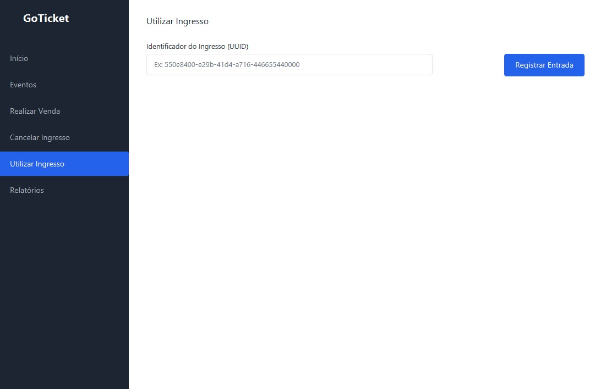
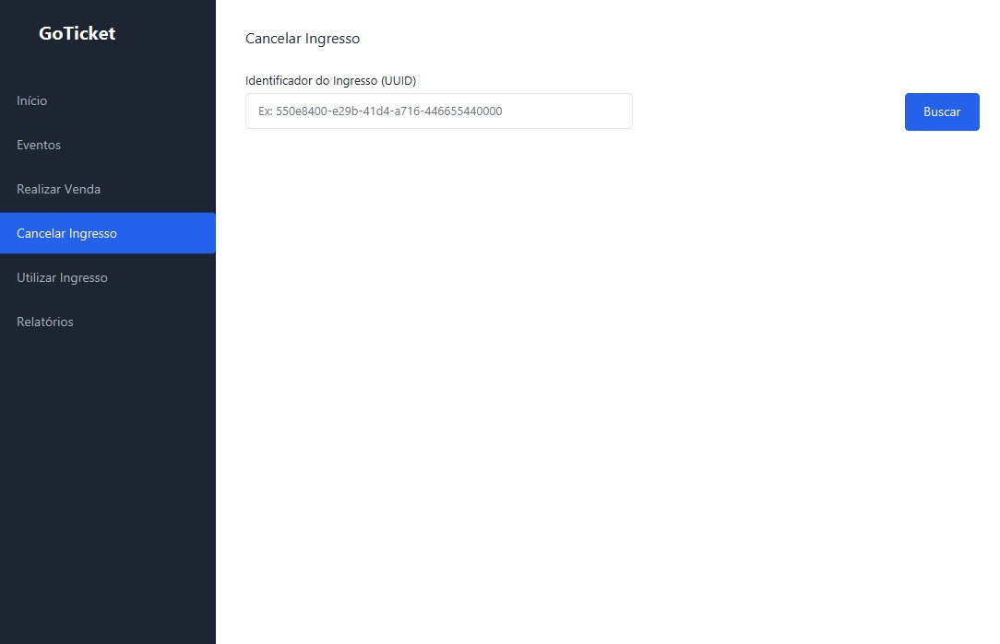
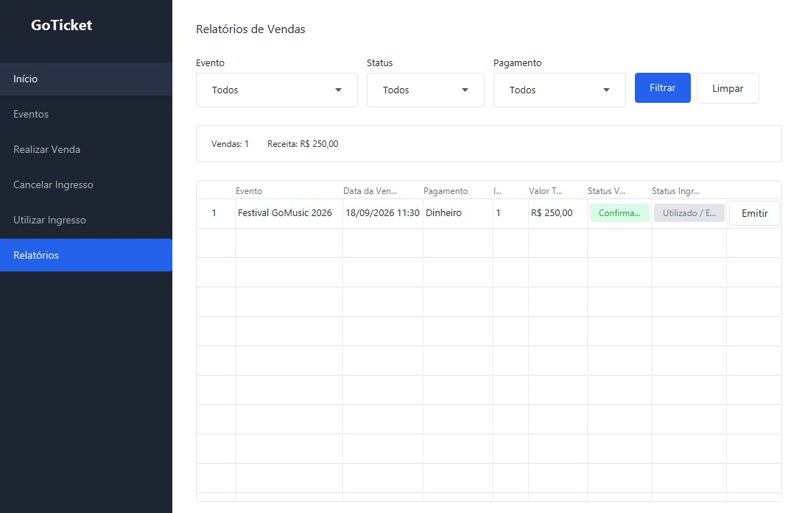

# 🎟️ GoTicket — Sistema de Gestão e Venda Presencial de Ingressos

Aplicação desktop profissional para gestão completa de eventos, setores, lotes de ingressos, participantes, vendas presenciais na bilheteria física, emissão de comprovantes/ingressos em PDF com QR Code, cancelamentos de vendas, controle de portaria (check-in) e relatórios gerenciais.

---

## 1. 📌 Nome do Projeto
**GoTicket** — Plataforma Desktop de Gestão de Eventos e Ponto de Venda (PDV) de Ingressos Presenciais.

---

## 2. 🎯 Objetivo
O **GoTicket** foi desenvolvido para resolver a complexidade operacional da gestão e venda física de ingressos em eventos de pequeno, médio e grande porte.

- **Problema que resolve**: Filas extensas em bilheterias físicas, falta de controle em tempo real sobre a lotação de setores e esgotamento de lotes, fraudes no controle de acesso e dificuldade no cancelamento e estorno de ingressos de forma rastreável.
- **Público-alvo**: Produtores de eventos, administradores de casas de espetáculo, operadores de bilheteria física e equipes de portaria/controle de acesso.

---

## 3. ✨ Funcionalidades Principais
- 🔐 **Autenticação & Controle de Acesso**: Login seguro com hash de senha em BCrypt e controle de sessão por perfil de usuário.
- 🎪 **Gestão de Eventos**: Cadastro, edição, listagem, filtros e encerramento de eventos com controle de capacidade total.
- 💺 **Setores e Lotes de Ingressos**: Gerenciamento de setores (Pista, VIP, etc.), tipos de ingresso (Inteira, Meia-Entrada, etc.) e lotes com precificação e controle de saldo restante.
- 💳 **Ponto de Venda (PDV Bilheteria)**: Fluxo de venda assistido em 3 passos com validação de CPF, dados do participante, cálculo dinâmico de taxas e suporte a múltiplas formas de pagamento (PIX, Cartão de Crédito, Débito, Dinheiro).
- 📄 **Emissão de Ingressos em PDF**: Geração automática de comprovante e ingresso em PDF com QR Code e código de validação único.
- 🚫 **Cancelamento & Reembolso**: Módulo de cancelamento de vendas com devolução automática de estoque ao lote e registro de motivo/auditoria.
- 🎫 **Controle de Portaria (Check-in)**: Validação rápida de ingressos por código de barras/QR Code, impedindo uso duplicado ou ingressos cancelados.
- 📊 **Relatórios & Dashboard**: Visualização de métricas de vendas, faturamento total, taxa de ocupação e histórico de transações.

---

## 4. 🚀 Tecnologias Utilizadas
- **Linguagem**: Java 21 (LTS)
- **Interface Gráfica**: JavaFX 21 + FXML + CSS GoTicket Design System
- **Banco de Dados**: PostgreSQL 16+
- **Pool de Conexões**: HikariCP 5.1.0
- **Segurança & Criptografia**: jBCrypt 0.4
- **Emissão de Documentos PDF**: OpenPDF (LibrePDF 2.0.2) + ZXing (QR Code)
- **Testes Automatizados**: JUnit 5 + Mockito
- **Build & Gerenciamento de Dependências**: Apache Maven

---

## 5. ⚙️ Pré-requisitos
Antes de iniciar, certifique-se de ter instalado em seu ambiente:
- **Java JDK**: Versão 21 ou superior
- **Docker e Docker Compose** (Recomendado para o banco de dados) ou **PostgreSQL 16+** instalado localmente
- **Git** para clonagem do repositório

---

## 6. 🗄️ Banco de Dados
A aplicação utiliza o banco de dados relacional **PostgreSQL** com isolamento no schema `eventgo`.

### Opção A: Subir via Docker (Recomendado)
O projeto inclui um arquivo `docker-compose.yml` pré-configurado:
```bash
docker compose up -d
```
> O container iniciará o PostgreSQL na porta `5433` com o usuário `postgres` e senha `postgres`.

### Opção B: PostgreSQL Local
Caso utilize um PostgreSQL instalado localmente, crie a base de dados `eventgo_db` e ajuste as credenciais no arquivo `src/main/resources/database.properties` se necessário.

### Inicialização e Migrações de Schema
As migrações SQL localizadas em `src/main/resources/db/migration/` (`V1__schema_inicial.sql` e `V2__adicionar_status_emitido.sql`) são executadas automaticamente na inicialização da aplicação, criando tabelas, relacionamentos, constraints, índices e o usuário administrador inicial.

---

## 7. 💻 Como Executar

### 1. Clonar o Repositório
```bash
git clone https://github.com/gustavo-ferreirasantos/GoTicket.git
cd GoTicket
```

### 2. Iniciar o Banco de Dados
```bash
docker compose up -d
```

### 3. Executar a Aplicação
- **Windows (PowerShell / CMD)**:
  ```bash
  .\mvnw.cmd javafx:run
  ```
- **Linux / macOS**:
  ```bash
  ./mvnw javafx:run
  ```

### 4. Executar os Testes Automatizados
```bash
.\mvnw.cmd test
```

### 🔑 Credenciais de Acesso Inicial
- **Usuário**: `admin`
- **Senha**: `admin123`

---

## 8. 📋 Guia Rápido: Copiar e Colar para Testes

### 🎟️ Passo 1: Criar um Evento
Acesse o menu **Eventos** > clique em **Cadastrar Evento** (ou pelo atalho da página inicial) e preencha:

- **Nome do evento**:
```text
Festival GoMusic 2026
```
- **Descrição**:
```text
Festival de música ao vivo com múltiplos palcos e praça de alimentação.
```
- **Data**: Selecione uma data futura no calendário (ex: `20/12/2026`)
- **Horário**:
```text
20:00
```
- **Local**:
```text
Arena Central - São Paulo/SP
```
- **Capacidade**:
```text
5000
```
- **Situação**: Selecione `Aberto para Vendas` no seletor.

---

### 💺 Passo 2: Adicionar Setores e Lotes
Na tabela de Eventos, clique no botão **Setores** do evento criado:

#### ➕ Setor 1 (Pista):
- **Nome do setor**: `Pista`
- **Capacidade do setor**: `3500`
- **Tipo de ingresso**: `Inteira`
- **Preço do lote**: `100,00`
- **Quantidade de ingressos**: `2000`

#### ➕ Setor 2 (Camarote VIP):
- **Nome do setor**: `Camarote VIP`
- **Capacidade do setor**: `1500`
- **Tipo de ingresso**: `Inteira`
- **Preço do lote**: `250,00`
- **Quantidade de ingressos**: `1500`

---

### 💳 Passo 3: Realizar uma Venda (Bilheteria)
Acesse o menu **Bilheteria**, selecione o evento **Festival GoMusic 2026** e o setor **Pista**. Em seguida, cole os dados do participante:

#### Participante 1:
- **CPF**:
```text
123.456.789-09
```
- **Nome Completo**:
```text
Carlos Eduardo da Silva
```
- **E-mail**:
```text
carlos.silva@exemplo.com
```
- **Telefone** (apenas dígitos):
```text
11987654321
```

#### Participante 2 (Alternativo):
- **CPF**:
```text
111.444.777-35
```
- **Nome Completo**:
```text
Mariana Souza Santos
```
- **E-mail**:
```text
mariana.souza@exemplo.com
```
- **Telefone** (apenas dígitos):
```text
21998765432
```


---

## 9. 📁 Estrutura do Projeto
A arquitetura do software segue o padrão em camadas (Layered Architecture / MVC), garantindo separação clara de responsabilidades:

```text
ES2/
├── src/
│   ├── main/
│   │   ├── java/com/eventgo/
│   │   │   ├── config/               # Configurações do sistema e conexão com BD (HikariCP)
│   │   │   ├── controller/           # Controladores das telas JavaFX (interação com a UI)
│   │   │   ├── dao/                  # Camada de persistência e acesso a dados (SQL / JDBC)
│   │   │   ├── dto/                  # Objetos de transferência de dados (DTOs)
│   │   │   ├── model/                # Entidades de domínio do negócio
│   │   │   ├── service/              # Regras de negócio, validações e serviços (PDF, etc.)
│   │   │   ├── util/                 # Utilitários gerais (validação de CPF/e-mail, criptografia)
│   │   │   ├── App.java              # Classe de inicialização do ciclo de vida JavaFX
│   │   │   └── Main.java             # Ponto de entrada (main method)
│   │   └── resources/
│   │       ├── css/                  # Folhas de estilo CSS do design system
│   │       ├── db/migration/         # Scripts de migração SQL versionados
│   │       ├── fxml/                 # Arquivos de layout das telas em FXML
│   │       └── database.properties   # Parâmetros de conexão com o banco de dados
│   └── test/java/com/eventgo/        # Testes unitários com JUnit 5 e Mockito
├── docker-compose.yml                # Configuração do container PostgreSQL
├── pom.xml                           # Dependências e plugins do Maven
└── README.md                         # Documentação principal do repositório
```

---

## 10. 📸 Imagens do Sistema

| Tela de Login | Eventos |
| :---: | :---: |
|  |  |

| Realizar Venda | Controle de Portaria (Check-in)|
| :---: | :---: |
|  |  |

| Cancelamento de Ingressos | Relatórios |
| :---: | :---: |
|  |  |

---

## 11. 📐 Modelagem e Documentação
Toda a documentação complementar de engenharia de software e modelagem do sistema está centralizada no diretório [`/docs`](docs/):

- **Diagramas de Casos de Uso**: [`docs/diagramas/casos_de_uso/`](docs/diagramas/casos_de_uso/)
  - Visão geral dos atores e casos de uso do sistema.
- **Diagramas de Atividades**: [`docs/diagramas/atividades/`](docs/diagramas/atividades/)
  - Fluxos de autenticação, cadastro de eventos/setores, venda presencial, emissão de comprovante e check-in.
- **Diagramas de Sequência**: [`docs/diagramas/sequencial/`](docs/diagramas/sequencial/)
  - Comunicação síncrona entre UI, Controllers, Services, DAOs e Banco de Dados.

---

## 12. 👥 Equipe
Projeto desenvolvido para a disciplina de Engenharia de Software II.


- **Integrante 1**: Gustavo Ferreira Santos — *GitHub: [https://github.com/gustavo-ferreirasantos](https://github.com/gustavo-ferreirasantos)* 
- **Integrante 2**: Joison Júnior Cavalcanti Rodrigues — *GitHub: [https://github.com/JoisonJr](https://github.com/JoisonJr)* 
- **Integrante 3**: Daniel Mendonça Paiva — *GitHub: [https://github.com/DanielMendpaiva](https://github.com/DanielMendpaiva)*
- **Integrante 4**: Lorenzo de Souza Oliveira — *GitHub: [https://github.com/Lanoze](https://github.com/Lanoze)* 
- **Integrante 5**: Carlos Eduardo Batista Diniz — *GitHub: [https://github.com/CaduBD](https://github.com/CaduBD)* 

---

## 13. 🏆 Contribuições
Resumo das principais atribuições e módulos implementados pelo grupo:
- **Arquitetura & Infraestrutura**: Modelagem do banco relacional, migrations SQL, containerização via Docker e configuração do HikariCP.
- **Camada de Negócio & Segurança**: Implementação dos Services, validações de CPF/E-mail, regras de estoque de lotes e criptografia BCrypt.
- **Interface & Experiência do Usuário (UI/UX)**: Telas FXML em JavaFX com estilização CSS GoTicket Design System inspirada no protótipo do Figma.
- **Emissão de PDF & Validação**: Geração de ingressos com QR Code (ZXing + OpenPDF) e módulo de validação de portaria (check-in).
- **Qualidade de Software**: Criação de suítes de testes unitários automatizados com JUnit e Mockito.

---

## 14. 🔮 Limitações e Melhorias Futuras
Como evolução futura do GoTicket para além do escopo da disciplina, destacam-se:
- 💳 **Integração com Gateway de Pagamento**: Conexão direta com APIs de pagamento (ex: Mercado Pago / Stripe) para geração automática e confirmação via webhook de cobranças PIX e maquininhas TEF/POS.
- 📱 **Aplicativo Mobile para Portaria**: App complementar para leitura de QR Code da portaria através da câmera de smartphones Android/iOS.
- 📧 **Envio Automático por E-mail/WhatsApp**: Disparo assíncrono dos ingressos em PDF diretamente no e-mail do participante ou via WhatsApp API.
- 📈 **Dashboard de BI em Tempo Real**: Métricas avançadas de conversão, gráficos de horários de pico e mapa de calor de entrada na portaria.
- 🌐 **Módulo Web para Compra Online**: Versão web integrada para permitir vendas online simultâneas à bilheteria física.